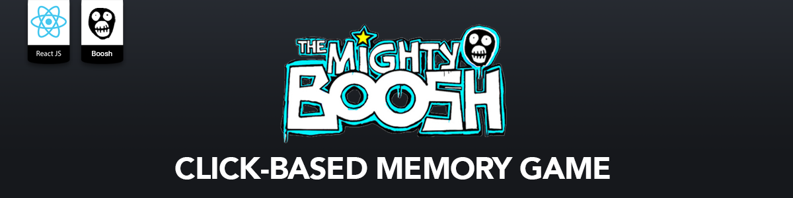

**React Clicky Game**
======

> ### Deployed to GitHub Pages [here](https://ashleyallphin.github.io/react-clicky-game/).

UTA-VIRT-FSF-PT-01-2020-U-LOL&nbsp;&nbsp;&nbsp;|&nbsp;&nbsp;&nbsp;Homework #19&nbsp;&nbsp;&nbsp;|&nbsp;&nbsp;&nbsp;Ashley Allphin

This project was bootstrapped with [Create React App](https://github.com/facebookincubator/create-react-app).

# Overview

Clicky Game is a React-based memory challenge app.

## Game Instructions
A dozen Mighty Boosh characters are rendered to the page.  Click on each character without repeating until all twelve characters have been selected to win the game.  If a character is clicked twice, the game will restart.

## Functionality

- Character Card props are rendered to the page.  Each click is recorded and initiates shuffling of card positions.
- Selecting a new character increments the user's score by 1.
- Clicking on a previously selected character resets the user's score to 0 and starts a new game.
- Clicking on all twelve cards without repeating will result in a win message and set the highest score to 12.

## Resources
* [React](https://reactjs.org/)
* [JSX](https://reactjs.org/docs/introducing-jsx.html)
* [JavaScript/ES6](http://es6-features.org/#Constants)
* [Node dependencies](https://nodejs.org/en/), [Yarn Package Manager](https://yarnpkg.com/)
* [React Bootsrap](https://react-bootstrap.github.io/)
* VS Code, Adobe Photoshop, Adobe Illustrator

## Installation
To clone this repository:

    `$ git clone https://github.com/ashleyallphin/react-clicky-game.git`

To install dependencies:

    `$ npm install --save`

To run on localhost PORT 3000:

    `$ npm run start`

### Plans for Future Development
- Finalize styling
- Add modal when game is won
- Add shake animation to cards to alert user when game is lost

